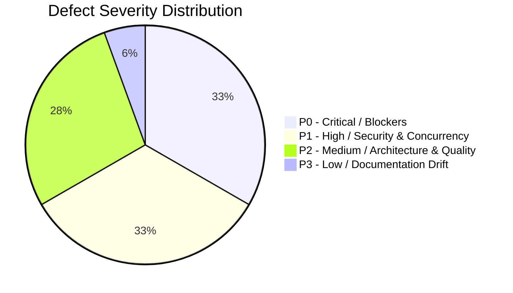

# Forensic Engineering Audit Report: Project FRIDAY

**Audit Date:** 2026-08-21  
**Audit Target:** Full Codebase (`d:\FRIDAY`)  
**Auditor:** Antigravity Autonomous Forensic Inspection Core  
**Repository State:** **INCOMPLETE / DEGRADED** (149 test failures, multiple critical runtime and security defects)

---

## Executive Summary

A forensic code audit was conducted on the current state of the FRIDAY repository without relying on existing Phase 1–10 completion reports, test count claims, or README documentation. 

### Key Findings
1. **Actual Automated Test Status:** Full test suite execution reveals **149 failed tests**, 447 passed, 5 deselected (75.45s). The claim in `phase10_final_report.md` that all 596 tests passed is false.
2. **Core Memory & Persistence Broken:** A missing symbol `filter_secrets` in [`src/friday/memory/sqlite.py`](file:///d:/FRIDAY/src/friday/memory/sqlite.py#L300) causes immediate `NameError` crashes on message storage, breaking all agent reasoning, memory persistence, and 101 unit/integration tests.
3. **Broken Tool Execution & Async Timeout Model:** [`src/friday/tools/registry.py`](file:///d:/FRIDAY/src/friday/tools/registry.py#L188-L189) attempts to invoke `asyncio.get_event_loop()` and passes keyword arguments to `loop.run_in_executor(None, tool.execute, **exec_args)`, crashing with `RuntimeError` and `TypeError` across worker threads (responsible for 32 test failures).
4. **Simulated / Fake Hardware Execution:** [`src/friday/vision/computer_control.py`](file:///d:/FRIDAY/src/friday/vision/computer_control.py#L178-L189) claims to perform Win32 `SendInput` host action execution, but contains zero OS input synthesis code, returning a hardcoded success object.
5. **Security & Secret Exfiltration Risks:** [`src/friday/tools/builtin/file_reader.py`](file:///d:/FRIDAY/src/friday/tools/builtin/file_reader.py#L31) is classified as `SAFE` (auto-executes without confirmation) and lacks `.env` or credential file path filtering, permitting untrusted prompts to read secret API keys.
6. **Prompt Injection Regex Defect:** [`src/friday/security/prompt_injection.py`](file:///d:/FRIDAY/src/friday/security/prompt_injection.py#L49) uses `r"\\b(?:run|execute)\\b"` (matching literal `\b` instead of regex word boundaries), failing to detect execution keywords, while overzealously blocking any message containing the string `"base64"`.

---

## P0 / P1 / P2 / P3 Defect Inventory

### P0 Defects (Critical / Blocker)

| Defect ID | File & Symbol | Root Cause | Impact | Required Fix |
|---|---|---|---|---|
| **DEF-P0-001** | [`src/friday/memory/sqlite.py:300`](file:///d:/FRIDAY/src/friday/memory/sqlite.py#L300) `SQLiteConversationMemory.add_message` | Calls undefined function `filter_secrets(message.content)`. | Fatal crash (`NameError`) on every message save. Breaks all agent conversations, memory recall, and 101 tests. | Define/import proper secret redaction function (e.g. `redact_sensitive_visual_text` from security module) in `sqlite.py`. |
| **DEF-P0-002** | [`src/friday/tools/registry.py:188-189`](file:///d:/FRIDAY/src/friday/tools/registry.py#L188-L189) `ToolRegistry.execute` | 1) Calls `asyncio.get_event_loop()` in worker threads (`RuntimeError`). 2) Passes `**exec_args` to `loop.run_in_executor()` (`TypeError`). | Breaks all sync tool execution with timeouts inside thread pools. 32 test failures. | Refactor sync tool execution to use `functools.partial` or direct thread pool execution without creating mismatched event loops. |
| **DEF-P0-003** | [`src/friday/llm/gemini_provider.py:78,106`](file:///d:/FRIDAY/src/friday/llm/gemini_provider.py#L78) `GeminiLLMProvider.client` | Calls `get_settings()` without importing `from friday.core.config import get_settings`. | `NameError: name 'get_settings' is not defined` when client initializes without explicit key or pool. | Add `from friday.core.config import get_settings` import. |
| **DEF-P0-004** | [`src/friday/tasks/scheduler.py:124`](file:///d:/FRIDAY/src/friday/tasks/scheduler.py#L124) `TaskScheduler._execute_task` | Instantiates `TaskRunLog` but omitted it from `.models` imports. | Fatal `NameError` whenever background scheduled tasks complete and write run logs. | Add `TaskRunLog` to `from .models import ...` in `scheduler.py`. |
| **DEF-P0-005** | [`src/friday/vision/computer_control.py:178-189`](file:///d:/FRIDAY/src/friday/vision/computer_control.py#L178-L189) `ComputerActionExecutor.execute_proposal` | Claims physical Win32 `SendInput` execution, but only logs and returns hardcoded `ActionExecutionResult(is_success=True)`. | False capability claim; host OS control is purely simulated. | Implement genuine ctypes `SendInput` dispatch with explicit user confirmation safety gates. |
| **DEF-P0-006** | [`src/friday/tools/builtin/file_reader.py:31-60`](file:///d:/FRIDAY/src/friday/tools/builtin/file_reader.py#L31-L60) `FileReaderTool.execute` | Safe tool without `.env`, `.git/`, or credential file path filtering. | Critical security leak: LLM/prompt injection can read `.env` and exfiltrate production secrets without confirmation. | Enforce sensitive file exclusion (`.env*`, `*.key`, `*.pem`, `*.db`, `.git*`). |

---

### P1 Defects (High / Security & Concurrency)

| Defect ID | File & Symbol | Root Cause | Impact | Required Fix |
|---|---|---|---|---|
| **DEF-P1-001** | [`src/friday/security/prompt_injection.py:49`](file:///d:/FRIDAY/src/friday/security/prompt_injection.py#L49) `_MEDIUM_RISK_PATTERNS` | `re.compile(r"\\b(?:run|execute)\\b", re.IGNORECASE)` uses double backslash in raw string. | Matches literal `\b` character instead of word boundary. Execution injection keywords are never detected. | Fix regex to `r"\b(?:run|execute)\b"`. |
| **DEF-P1-002** | [`src/friday/security/prompt_injection.py:43`](file:///d:/FRIDAY/src/friday/security/prompt_injection.py#L43) `_HIGH_RISK_PATTERNS` | `re.compile(r"base64,?([A-Za-z0-9+/=]+)")` matches any text containing the word 'base64'. | Legitimate conversations mentioning base64 are blocked and blanked. | Refine detection to target high-entropy instruction payloads. |
| **DEF-P1-003** | [`src/friday/auth/credential_pool.py:110`](file:///d:/FRIDAY/src/friday/auth/credential_pool.py#L110) `GeminiCredentialPool.__init__` | Singleton recreates `self.lock = threading.Lock()` on repeated `__init__` calls with `keys`. | Race condition: existing locks are overwritten during multi-threaded failover. | Initialize `self.lock` once in `__new__` or protect re-init. |
| **DEF-P1-004** | [`src/friday/voice/audio_io.py:158`](file:///d:/FRIDAY/src/friday/voice/audio_io.py#L158) `MicrophoneStream._callback` | Calls `asyncio.Queue.put_nowait()` directly from PortAudio C callback thread when loop is unset. | `asyncio.Queue` is not thread-safe; corrupts queue state and drops audio. | Use `call_soon_threadsafe` or thread-safe `queue.Queue` bridge. |
| **DEF-P1-005** | [`src/friday/voice/gemini_provider.py:90`](file:///d:/FRIDAY/src/friday/voice/gemini_provider.py#L90) `GeminiVoiceProvider.run_session` | In running loop, creates unawaited task via `asyncio.create_task` and returns immediately. | Premature termination and dropped voice sessions. | Require explicit async invocation or await task completion. |
| **DEF-P1-006** | [`src/friday/agent/executor.py:205`](file:///d:/FRIDAY/src/friday/agent/executor.py#L205) `TaskExecutionEngine.execute_plan` | Type annotation `Set[str]` used without `Set` imported from `typing`. | Potential runtime `NameError` during type introspection. | Add `Set` to `typing` imports. |

---

### P2 Defects (Medium / Architecture & Quality)

| Defect ID | File & Symbol | Root Cause | Impact | Required Fix |
|---|---|---|---|---|
| **DEF-P2-001** | [`src/friday/llm/gemini_provider.py:325`](file:///d:/FRIDAY/src/friday/llm/gemini_provider.py#L325) `GeminiLLMProvider._build_gemini_payload` | Builds legacy REST dictionaries (`generationConfig`, `systemInstruction`) instead of `google-genai` SDK objects. | Schema inconsistency between SDK and test serialization helpers. | Unify serialization with `genai_types.GenerateContentConfig`. |
| **DEF-P2-002** | [`src/friday/vision/gemini_vision.py:207`](file:///d:/FRIDAY/src/friday/vision/gemini_vision.py#L207) `GeminiVisionProvider.analyze_image` | In failover catch, queries old failed key for next label and leaves `next_c` unused. | Incorrect log diagnostic message on quota failover. | Query new active key label via `get_active_key()`. |
| **DEF-P2-003** | [`src/friday/vision/vision_memory.py:35`](file:///d:/FRIDAY/src/friday/vision/vision_memory.py#L35) vs `episodic_memory.py` vs `embeddings/gemini.py` | Secret redaction regex patterns are duplicated across 3 separate files. | Architectural divergence and maintenance overhead. | Consolidate secret redaction into a single utility module `friday.security.redaction`. |
| **DEF-P2-004** | [`tests/real_world_acceptance_test.py:12-100`](file:///d:/FRIDAY/tests/real_world_acceptance_test.py#L12-L100) `test_real_world_acceptance` | Acceptance matrix consists of hardcoded `*_success = True` flags and simulated exceptions. | Does not test actual production code; provides false assurance. | Refactor to execute real agent and vision pipelines with recorded mock fixtures. |
| **DEF-P2-005** | [`tests/test_multimodal_acceptance_gate.py:60-85`](file:///d:/FRIDAY/tests/test_multimodal_acceptance_gate.py#L60-L85) | Acceptance test uses a custom mock responder that hardcodes the expected answer string. | Tests the mock's return value rather than FRIDAY's prompt injection defenses. | Test against `AutonomousSafetyGate` evaluation logic directly. |

---

### P3 Defects (Low / Documentation Drift)

| Defect ID | File & Symbol | Root Cause | Impact | Required Fix |
|---|---|---|---|---|
| **DEF-P3-001** | [`phase10_final_report.md:19`](file:///d:/FRIDAY/phase10_final_report.md#L19), [`FRIDAY_DIARY.md`](file:///d:/FRIDAY/FRIDAY_DIARY.md), [`README.md`](file:///d:/FRIDAY/README.md) | Reports claim 100% test pass rate ("596 passed, 0 failures") and full completion. | Stale and misleading documentation. | Update documentation to reflect current defect inventory and audit status. |

---

## Machine-Readable Defect Artifact

The full machine-readable JSON defect catalog has been generated and persisted at:
[`d:/FRIDAY/audit/forensic_audit_inventory.json`](file:///d:/FRIDAY/audit/forensic_audit_inventory.json)

---

## Conclusion & Next Steps

FRIDAY cannot be declared complete. The codebase exhibits critical defects in its persistence engine, tool orchestration, and security boundary layers, alongside simulated stubs masquerading as physical hardware execution. 

Before any release or feature claims can be made:
1. Fix P0 runtime crashes (`filter_secrets` in `sqlite.py`, event loop in `registry.py`, missing imports in `gemini_provider.py` and `scheduler.py`).
2. Remediate `.env` secret reading vulnerability in `FileReaderTool`.
3. Fix prompt injection regex and singleton race conditions.
4. Replace simulated computer control stubs with verified implementations or document sandbox boundaries accurately.
