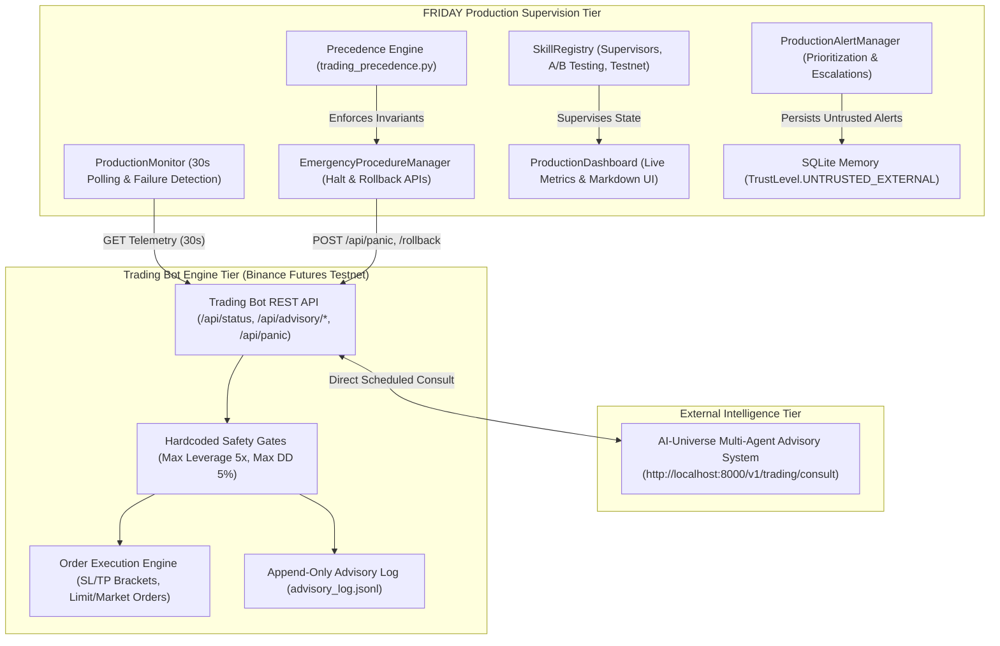

# 🏭 FRIDAY Production Operations & Architecture Guide

This document outlines the production architecture, multi-tier operational workflows, security boundaries, performance tuning, and incident mitigation strategies for FRIDAY's supervisory system.

---

## 🏛️ Comprehensive Architecture & Invariant Model

### Precedence Hierarchy Invariant:
$$\text{Safety Gates (Level 100)} > \text{FRIDAY Commands (Level 50)} > \text{AI-Universe Recommendations (Advisor - Level 10)}$$

1. **Safety Gates (Level 100)**: The Trading Bot's hardcoded risk constraints outrank all external signals. No command from FRIDAY or AI-Universe can bypass these limits.
2. **FRIDAY Commands (Level 50)**: FRIDAY acts as the human operator's executive supervisor. FRIDAY can override AI recommendations, toggle testnet advisory modes, execute rollbacks, or activate the panic kill-switch.
3. **AI-Universe Recommendations (Level 10)**: Purely advisory parameter suggestions. Only applied if they pass safety gate validation.

---

## 🛡️ Security, Access Control & Memory Boundaries

### 1. Capability Gating & Tiered Authorization
- **`SAFE`**: Read-only queries (`"System status"`, `"Trading performance"`, `"What did AI-Universe recommend?"`).
- **`SENSITIVE`**: Mode toggles, parameter rollbacks (`"Toggle testnet advisory"`, `"Rollback parameters"`).
- **`DANGEROUS`**: Emergency panic kill-switch (`"Emergency halt"`, `"Trigger panic"`).

### 2. Memory Isolation
- All external AI-Universe recommendations, advisory summaries, and alerts persisted into FRIDAY's SQLite memory must carry `TrustLevel.UNTRUSTED_EXTERNAL`. This prevents external payloads from influencing FRIDAY's core internal reasoning.

### 3. Cryptographic Audit Trail
- Every emergency intervention (`TRADING_HALT`, `PARAMETER_ROLLBACK`, `ADVISORY_DISABLE`) is recorded in an immutable SHA-256 hash-chained block structure via `EmergencyProcedureManager.get_audit_trail()`.

---

## 📊 Monitoring, Alert Aggregation & Escalation

### Prioritization Matrix:
| Severity | Description | Routing Channels | Escalation Timeout |
| :--- | :--- | :--- | :---: |
| **`INFO`** | Normal events (A/B progress, parameter update) | Dashboard, Memory | None |
| **`WARNING`** | Contested advisories, mode change to APPLY | Dashboard, Voice, Memory | 15 mins |
| **`ERROR`** | Degradation in AI-Universe service | Dashboard, Voice, Email | 10 mins |
| **`CRITICAL`** | Drawdown breach, Trading halt, Bot unreachable | Voice, SMS, Email, Dashboard | 5 mins |

### Alert Correlation:
The `ProductionAlertManager` correlates duplicate alerts occurring within a 60-second time window using composite correlation keys (`category:title`), incrementing occurrence counters rather than creating noisy alert storms.

---

## 🚀 Performance Tuning & Latency Optimization

1. **Connection Pooling**: Use `httpx.AsyncClient` or keep-alive HTTP sessions to minimize connection handshake latency.
2. **Asynchronous Polling**: Background monitors run non-blocking threads with staggered polling timers (Monitor: 30s, Watchdogs: 15m).
3. **Database WAL Mode**: SQLite database runs with Write-Ahead Logging (`PRAGMA journal_mode=WAL;`) to allow concurrent reads during background alert writes.
