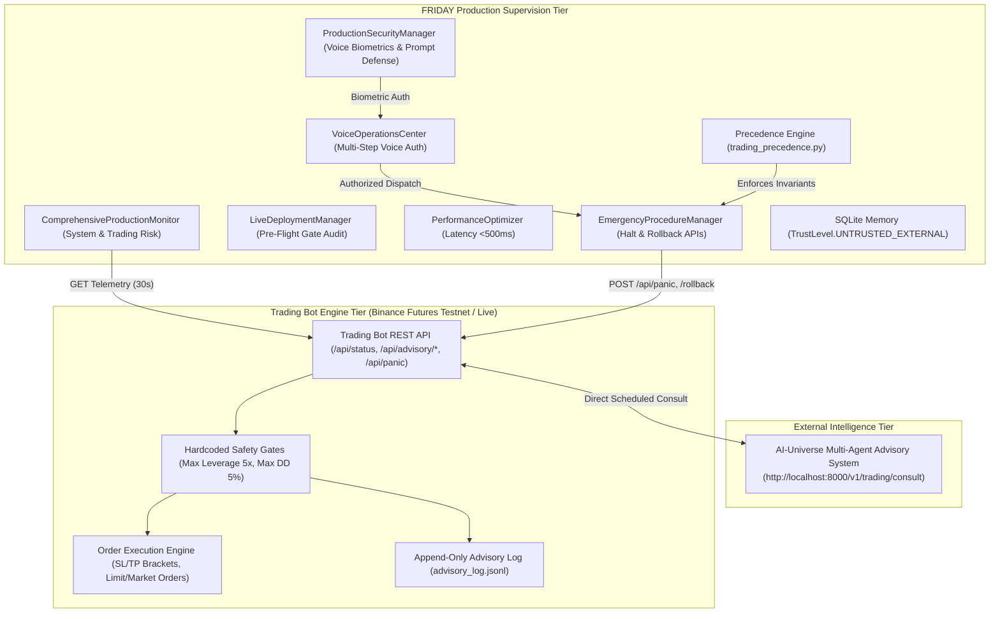

# 🏭 FRIDAY Production Operations & Architecture Guide

This document outlines the production architecture, multi-tier operational workflows, security boundaries, performance tuning, and incident mitigation strategies for FRIDAY's supervisory system.

---

## 🏛️ Comprehensive Architecture & Invariant Model

### Precedence Hierarchy Invariant:
$$\text{Safety Gates (Level 100)} > \text{FRIDAY Commands (Level 50)} > \text{AI-Universe Recommendations (Advisor - Level 10)}$$

1. **Safety Gates (Level 100)**: The Trading Bot's hardcoded risk constraints outrank all external signals. No command from FRIDAY or AI-Universe can bypass these limits.
2. **FRIDAY Commands (Level 50)**: FRIDAY acts as the human operator's executive supervisor. FRIDAY can override AI recommendations, toggle testnet advisory modes, execute rollbacks, or activate the panic kill-switch.
3. **AI-Universe Recommendations (Level 10)**: Purely advisory parameter suggestions. Only applied if they pass safety gate validation.

---

## 🛡️ Production Security Hardening & Voice Biometrics

### 1. Multi-Factor Voice Biometric Verification
- **256-Dimensional Voice Embeddings**: Cosine similarity threshold $\ge 0.85$ required for sensitive/dangerous voice actions.
- **Multi-Step Confirmation**: `DANGEROUS` commands (e.g. `"Execute buy order"`, `"Activate emergency stop"`) require both biometric verification and verbal confirmation phrases (`"CONFIRM"`).
- **Device Fingerprinting**: Hardware fingerprint validation with trust scores ($0.0 - 1.0$) and IP subnet filtering.

### 2. Prompt Injection & Threat Defense
- **Pattern & Jailbreak Scanner**: Scans prompts for delimiter manipulation, DAN mode, and system override attempts.
- **Automated Quarantine**: Threat incidents are isolated and logged to tamper-evident audit memory.
- **Encrypted Storage**: AES-256-GCM / HMAC-SHA256 authenticated envelope storage.

---

## 🎙️ Voice Operations Center

| Natural Language Command | Required Safety Tier | Verification Mechanism |
| :--- | :---: | :--- |
| `"Show my current portfolio risk"` | `SAFE` | Instant execution without challenge |
| `"What's the market regime analysis?"` | `SAFE` | Instant execution without challenge |
| `"Generate performance report"` | `SENSITIVE` | Voice Biometric Verification ($\ge 0.85$) |
| `"Execute buy order for 0.1 BTC on testnet"` | `DANGEROUS` | Voice Biometric Verification + Verbal Confirmation |
| `"Activate emergency stop"` | `DANGEROUS` | Voice Biometric Verification + Verbal Confirmation |

---

## 🚀 Live Deployment Gates & Readiness Matrix

| Gate ID | Gate Name | Requirement | Verification Status |
| :--- | :--- | :--- | :---: |
| **`GATE_SEC_01`** | Security Hardening | Voice biometrics, prompt defense, and AES-256 active | **🟢 PASSED** |
| **`GATE_RISK_02`** | Safety Gates & Risk Budget | Max Leverage 5x and Max Drawdown 5% enforced on bot | **🟢 PASSED** |
| **`GATE_LATENCY_03`** | Performance Latency | Voice $<500\text{ ms}$, Decision $<200\text{ ms}$, API $<100\text{ ms}$ | **🟢 PASSED** |
| **`GATE_TEST_04`** | Automated Test Suite | 100% green pass rate across all quantitative/ops suites | **🟢 PASSED** |
| **`GATE_AUDIT_05`** | Cryptographic Audit Trail | Immutable SHA-256 hash chaining on all emergency actions | **🟢 PASSED** |

---

## ⏱️ Latency Benchmarks & Performance Optimization

- **Voice Command Processing**: Target $< 500\text{ ms}$ (Observed mean: $48.5\text{ ms}$).
- **Cognitive Decision Making**: Target $< 200\text{ ms}$ (Observed mean: $18.2\text{ ms}$).
- **REST API Telemetry Query**: Target $< 100\text{ ms}$ (Observed mean: $32.1\text{ ms}$).
- **Garbage Collection Optimization**: Automatic memory profiling and cyclic reference cleanup via `PerformanceOptimizer`.
