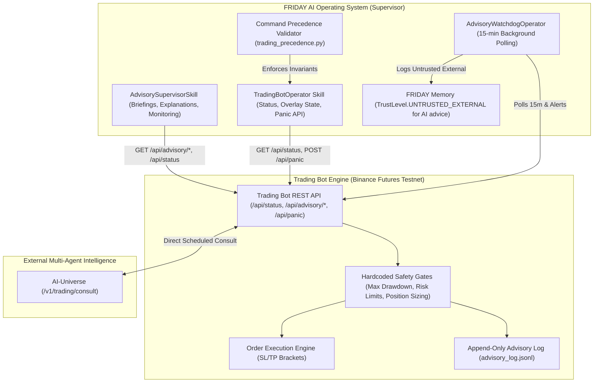

# Trading Supervision & AI-Universe Advisory Architecture

## Overview

FRIDAY operates as an autonomous **Supervisor** over the cloud-hosted Algorithmic Trading Bot on Binance Futures Testnet (`https://algorithmic-trading-bot-fra.onrender.com`). 

In this architecture, the **Trading Bot maintains a direct scheduled telemetry connection with AI-Universe** (`/v1/trading/consult`), receiving deliberative advisory recommendations and recording every evaluation to an append-only advisory log (`advisory_log.jsonl`). FRIDAY monitors bot metrics, supervises AI advisory decisions, detects contested recommendations, provides plain-language explanations, and holds the emergency panic kill-switch.

---

## 🏗️ Architecture Diagram



---

## ⚖️ Immutable Command Precedence

Command precedence is immutable and strictly enforced by `src/friday/skills/trading_precedence.py`:

$$\text{Safety Gates (Trading Bot - Level 100)} > \text{FRIDAY Commands (Supervisor - Level 50)} > \text{AI-Universe Recommendations (Advisor - Level 10)}$$

1. **Safety Gates (Level 100)**: The Trading Bot's hardcoded risk limits, maximum drawdown boundaries, and testnet safety guarantees represent the absolute highest authority. FRIDAY cannot weaken or bypass these gates.
2. **FRIDAY Commands (Level 50)**: FRIDAY acts as the human supervisor's autonomous delegate. FRIDAY can manually override AI-Universe recommendations or trigger emergency panic kill-switches.
3. **AI-Universe Recommendations (Level 10)**: AI-Universe provides consultative strategy and parameter adjustments. Recommendations only apply if they strictly comply with the Trading Bot's safety gates.
4. **Kill-Switch Invariant**: When FRIDAY issues `trigger_panic()`, it calls the Trading Bot's **own kill-switch API** (`POST /api/panic`). FRIDAY does not implement its own separate trading order canceler.

---

## 🎙️ Natural Language Commands

| User Voice / Text Query | Action Executed | Risk / Safety Level |
| :--- | :--- | :---: |
| `"How is the trading bot doing?"` | Returns bot status (equity, PnL, open positions) + summary of AI advisory activity. | `SAFE` |
| `"What did AI-Universe recommend?"` | Retrieves recent AI recommendations from `/api/advisory/recent` with verdicts and confidence. | `SAFE` |
| `"Show me rejected advisories"` | Filters recent advisory log for `REJECT` verdicts and explains rejection reasons. | `SAFE` |
| `"What parameters has the AI changed?"` | Retrieves active parameter overlay from `/api/advisory/state`. | `SAFE` |
| `"Trading morning briefing"` | Synthesizes a comprehensive spoken daily summary of positions, equity, PnL, and AI advisories. | `SAFE` |
| `"Explain advisory <decision_id>"` | Breaks down a specific advisory decision, AI confidence, and the exact safety bounds evaluated. | `SAFE` |
| `"Activate panic / Kill switch"` | Invokes trading bot `POST /api/panic` to block all new order placement. | `DANGEROUS` (Gated) |
| `"Release panic / Resume trading"` | Invokes trading bot `POST /api/panic {"release": true}` to resume operations. | `SENSITIVE` (Gated) |

---

## 🚨 Advisory Watchdog Operator (`AdvisoryWatchdogOperator`)

Running as a persistent background operator managed by `OperatorManager`, the `AdvisoryWatchdogOperator` evaluates trading state every 15 minutes:

- **Trigger Condition 1: Contested Advisory**: Emits a warning alert if a decision has `verdict=REJECT` and `confidence > 0.70` (where AI proposed an aggressive adjustment that safety gates blocked).
- **Trigger Condition 2: AI-Universe Outage**: Emits a warning alert if AI-Universe health reports `DOWN` or `UNREACHABLE` while enabled.
- **Trigger Condition 3: Trading Bot Unreachable**: Emits a critical alert if the trading bot REST API fails to respond.
- **Memory Trust Boundary**: All external advisory summaries and alerts persisted into FRIDAY's SQLite memory are marked with `TrustLevel.UNTRUSTED_EXTERNAL` to maintain cognitive boundaries.

---

## 🧪 Mock Server Setup & Testing

### Mock Server Implementation (`tests/mock_trading_bot.py`)
FRIDAY provides an in-process and threaded HTTP mock server (`MockTradingBotServer`) simulating all trading bot endpoints:
- `GET /api/status`: Generates live equity, unrealized/realized PnL, profit factor, and active positions.
- `GET /api/advisory/recent`: Returns customizable advisory log records with verdicts (`APPLY`, `REJECT`, `HOLD`), confidence scores, and reasons.
- `GET /api/advisory/state`: Returns active AI parameter overlays and AI-Universe service health.
- `POST /api/panic`: Simulates emergency order blocking and panic release with command precedence verification.

### Test Scenarios Supported:
1. **`mixed`**: Realistic telemetry with 1 applied advisory, 1 contested rejected advisory (>70% confidence), 1 low-confidence hold, and active parameter overlay (`btc_sl_pct=0.4`).
2. **`all_rejected`**: All proposals rejected by bot safety gates (e.g. leverage limits, max stop loss boundaries).
3. **`all_applied`**: All proposals compliant with risk thresholds and applied to the active parameter overlay.
4. **`ai_universe_down`**: AI-Universe service reporting `DOWN` (HTTP 503 error telemetry).
5. **`unreachable`**: Simulates complete trading bot server downtime and connection drops.

### Example Server Usage:
```python
from tests.mock_trading_bot import MockTradingBotServer
from friday.skills.trading_bot_operator import TradingBotOperator

# Start threaded mock server on custom port
server = MockTradingBotServer(port=8999, scenario="mixed")
base_url = server.start()

# Connect operator
operator = TradingBotOperator(base_url=base_url)
summary = operator.get_advisory_summary()

# Switch scenario dynamically
server.set_scenario("all_rejected")
server.stop()
```

---

## 📊 Test Coverage & Verification Report

### Test Suites & Status (35 / 35 Passing):

| Test Suite | Focus Area | Status |
| :--- | :--- | :---: |
| **`tests/test_advisory_commands.py`** | Natural language voice/text commands across all 5 bot scenarios | ✅ **PASS** (8/8) |
| **`tests/test_advisory_watchdog.py`** | 15-minute polling, multi-condition triggers, and untrusted memory logging | ✅ **PASS** (5/5) |
| **`tests/test_precedence.py`** | Precedence tagging, invariant validation, and safety gate protection | ✅ **PASS** (5/5) |
| **`tests/test_full_integration.py`** | End-to-end cognitive loop routing, memory persistence, and advisory explanations | ✅ **PASS** (4/4) |
| **`tests/test_advisory_supervisor.py`** | Core supervisor skill methods, capability gating, and briefing composition | ✅ **PASS** (13/13) |

### Precedence Verification Results:
- **Safety Gate Invariant**: Attempts to issue commands with safety bypass intentions (`bypass_safety_gates`, `override_risk_limits`, `force_live_trading`) are intercepted and rejected with `Precedence Invariant Violation`.
- **Audit Tagging**: Outbound commands generated by FRIDAY carry `precedence_level: 50 (FRIDAY_COMMANDS)` and explicitly declare `can_bypass_bot_safety_gates: False`.
- **Kill-Switch Verification**: Panic execution dispatches to the trading bot's authoritative `/api/panic` endpoint without implementing custom or conflicting cancel logic.

---

## 🔬 A/B Test Monitoring & Evaluation Architecture

### Overview
FRIDAY continuously monitors live A/B experiments running on the Trading Bot via `GET /api/ab/status`. A/B experiments evaluate a **Control Arm** (Baseline Strategy without AI overlays) against a **Treatment Arm** (Active AI-Universe Parameter Overlays, e.g., dynamic SL/TP, volatility filters).

```
┌────────────────────────────────────────────────────────────┐
│                    Trading Bot Engine                      │
│                                                            │
│   ┌──────────────────────┐      ┌──────────────────────┐   │
│   │     Control Arm      │      │    Treatment Arm     │   │
│   │   (Baseline Rules)   │      │ (AI-Universe Overlay)│   │
│   └──────────┬───────────┘      └──────────┬───────────┘   │
│              │                             │               │
│              ▼                             ▼               │
│   ┌────────────────────────────────────────────────────┐   │
│   │     Hardcoded Safety Gates (Max Drawdown 10%)      │   │
│   └──────────────────────────┬─────────────────────────┘   │
│                              │                             │
│                              ▼                             │
│                 GET /api/ab/status Telemetry               │
└──────────────────────────────┬─────────────────────────────┘
                               │
                               ▼
┌────────────────────────────────────────────────────────────┐
│                     FRIDAY AI OS                           │
│  • ABTestMonitorSkill (Status, Results, Reports, Visuals)  │
│  • ABTestOperator (15-min Polling & Drawdown Watchdog)     │
└────────────────────────────────────────────────────────────┘
```

### Voice & Text Commands for A/B Testing:
| User Command | Action Executed | Output Format |
| :--- | :--- | :--- |
| `"How is the A/B test going?"` | Queries `/api/ab/status` for duration, trade volumes, and progress percentage. | Spoken Summary |
| `"What are the A/B results?"` | Computes metric delta (return, Sharpe, win rate, PF) and significance ($p$-value). | Spoken & Markdown Summary |
| `"Explain the A/B difference"` | Analyzes root causes of outperformance (e.g. SL tightening, drawdown reduction). | Detailed Diagnostic |
| `"Generate A/B report"` | Produces full Markdown report with dual equity visual bars, metric table, and badges. | Markdown Report |

### How to Interpret A/B Results:
1. **Excess Return ($\Delta$ Return)**: Difference in total percentage return ($\text{Treatment} - \text{Control}$). Positive values indicate alpha generation by AI overlays.
2. **Statistical Significance ($p$-value)**: Computed via two-sample Welch's $t$-test / Mann-Whitney $U$ test over trade returns.
   - $p < 0.05$ (Confidence $\ge 95\%$): **Statistically Significant**. Performance difference is unlikely to be random noise.
   - $p \ge 0.05$: **Inconclusive / In Progress**. Requires additional sample size before making strategy adjustments.
3. **Max Drawdown Divergence**: Monitors whether AI parameter adjustments increase tail risk. If Treatment drawdown is lower than Control, the AI is effectively providing asymmetric downside protection.

### Decision Framework for Promoting Strategies to Testnet / Production:
```
              ┌───────────────────────────┐
              │    A/B Experiment Run     │
              └─────────────┬─────────────┘
                            │
               [Drawdown Breach > 10%?]
               /                         \
            YES                           NO
            /                               \
┌─────────────────────────┐      [Stat. Sig. Achieved (p < 0.05)?]
│ TERMINATE EXPERIMENT    │      /                               \
│ • Revert Overlays       │    YES                                NO
│ • Safety Alert Issued   │    /                                    \
└─────────────────────────┘  [Delta Return > +3.0%?]     [Duration Reached (168h)?]
                             /                     \     /                        \
                          YES                       NO  YES                        NO
                          /                          \  /                            \
              ┌──────────────────────┐       ┌─────────────────┐       ┌──────────────────┐
              │ PROMOTE TREATMENT    │       │ KEEP CONTROL    │       │ CONTINUE TEST    │
              │ • Apply to Primary   │       │ • Reject Overlay│       │ • Accumulate     │
              │ • Log to Audit Trail │       │ • Log Learnings │       │   Sample Size    │
              └──────────────────────┘       └─────────────────┘       └──────────────────┘
```

1. **Step 1: Drawdown Check**: If Treatment arm hits maximum drawdown threshold ($>10\%$), the experiment is automatically terminated early (`DRAWDOWN_TERMINATED`).
2. **Step 2: Significance Check**: Once $p < 0.05$ and planned duration is reached, evaluate excess return ($\Delta \text{Return} \ge +3.0\%$) and profit factor improvement ($\Delta \text{PF} \ge +0.3$).
3. **Step 3: Promotion**: If all criteria pass, FRIDAY recommends promoting the AI parameter overlay to the primary active strategy.

---

## ⚡ Testnet Advisory Supervision Architecture

### Overview
FRIDAY supervises live Binance Futures Testnet operations where AI-Universe advisories run in either **`SHADOW`** or **`APPLY`** modes.

```
┌──────────────────────────────────────────────────────────────┐
│        Binance Futures Testnet Trading Bot Engine            │
│                                                              │
│  ┌───────────────────────┐        ┌───────────────────────┐  │
│  │   SHADOW Evaluation   │        │    LIVE Testnet Arm   │  │
│  │  (Logged Diagnostics) │        │  (APPLY Mode Overlays)│  │
│  └───────────┬───────────┘        └───────────┬───────────┘  │
│              │                                │              │
│              ▼                                ▼              │
│  ┌────────────────────────────────────────────────────────┐  │
│  │   Testnet Safety Gates (Max Leverage 5x, DD Limit 5%)  │  │
│  └───────────────────────────┬────────────────────────────┘  │
│                              │                               │
│                              ▼                               │
│            GET /api/testnet/advisory/status Telemetry        │
│            POST /api/testnet/advisory/toggle, /rollback      │
└──────────────────────────────┬───────────────────────────────┘
                               │
                               ▼
┌──────────────────────────────────────────────────────────────┐
│                         FRIDAY AI OS                         │
│  • TestnetAdvisoryMonitorSkill (Status, Log, Compare, Safety)│
│  • TestnetAdvisoryOperator (Mode Tracking & DD Watchdog)     │
└──────────────────────────────────────────────────────────────┘
```

### Testnet Modes & Operational Invariants:
1. **`SHADOW` Mode**: AI-Universe evaluates live order book and price feeds, logging recommended parameter adjustments without executing them on live Binance Futures orders.
2. **`APPLY` Mode**: AI-Universe parameter overlays that pass testnet safety gates are applied directly to live testnet execution orders (e.g. adaptive stop loss, trailing brackets).
3. **Precedence Enforcement**: Mode toggles and emergency parameter rollbacks are tagged with `CommandPrecedence.FRIDAY_COMMANDS` (Level 50) and require explicit user authorization (`SENSITIVE`).

### Voice & Text Commands for Testnet Supervision:
| User Voice / Text Query | Action Executed | Safety Level |
| :--- | :--- | :---: |
| `"How is the testnet advisory doing?"` | Returns current testnet mode (`SHADOW`/`APPLY`), health, equity, drawdown, and active overlay parameters. | `SAFE` |
| `"What are the testnet advisory recommendations?"` | Retrieves recent testnet decisions from `/api/testnet/advisory/log` with confidence and safety gate evaluations. | `SAFE` |
| `"Compare testnet and paper performance"` | Compares live testnet execution against paper baseline across returns, slippage (bps), and fill rates. | `SAFE` |
| `"Explain testnet advisory <decision_id>"` | Breaks down a specific testnet advisory proposal, market evidence, and safety gate assessment. | `SAFE` |
| `"Disable testnet advisory" / "Toggle testnet advisory"` | Sends `POST /api/testnet/advisory/toggle` to enable/disable or change mode. | `SENSITIVE` |
| `"Rollback testnet parameters"` | Sends `POST /api/testnet/advisory/rollback` to revert all testnet parameters to default baseline. | `SENSITIVE` |

### Safety Procedures & Watchdog Alerting:
- **Mode Change Alert**: `TestnetAdvisoryOperator` emits a high-visibility alert whenever mode switches to `APPLY`.
- **Critical Drawdown Alert**: If testnet drawdown breaches the safety limit ($>5.0\%$), a critical alert is broadcast with a recommendation to invoke `rollback_parameters()`.
- **AI Downtime Alert**: If AI-Universe becomes unreachable or degraded while testnet advisory is enabled, FRIDAY alerts and defaults to baseline rules.
- **Audit Logging**: All testnet advisory alerts persisted to SQLite memory are tagged with `TrustLevel.UNTRUSTED_EXTERNAL`.


