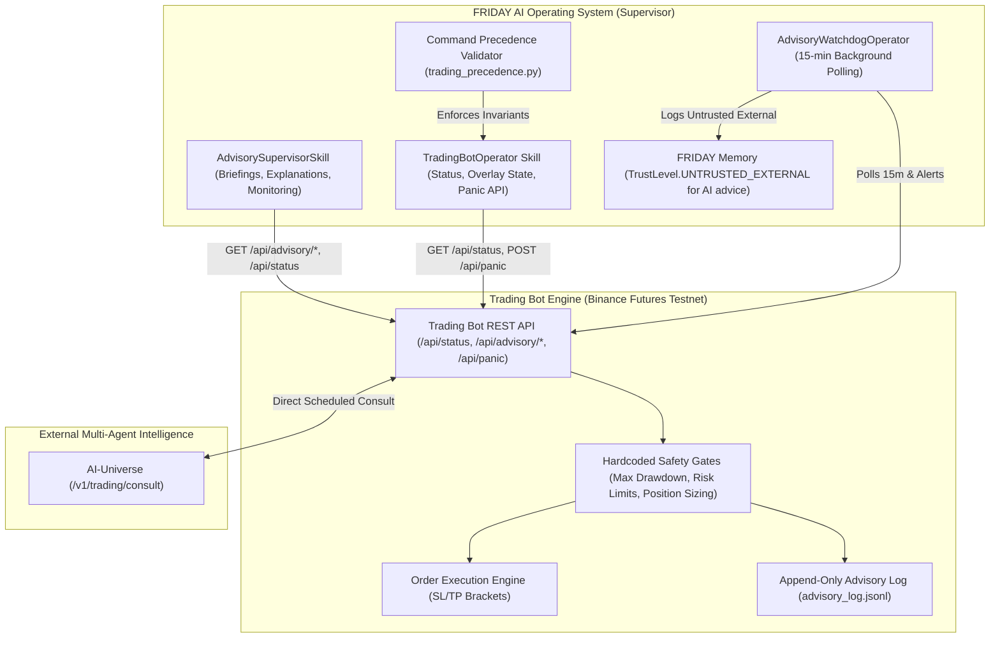

# Trading Supervision & AI-Universe Advisory Architecture

## Overview

FRIDAY operates as an autonomous **Supervisor** over the cloud-hosted Algorithmic Trading Bot on Binance Futures Testnet (`https://algorithmic-trading-bot-fra.onrender.com`). 

In this architecture, the **Trading Bot maintains a direct scheduled telemetry connection with AI-Universe** (`/v1/trading/consult`), receiving deliberative advisory recommendations and recording every evaluation to an append-only advisory log (`advisory_log.jsonl`). FRIDAY monitors bot metrics, supervises AI advisory decisions, detects contested recommendations, provides plain-language explanations, and holds the emergency panic kill-switch.

---

## 🏗️ Architecture Diagram

---

## ⚖️ Immutable Command Precedence

Command precedence is immutable and strictly enforced by `src/friday/skills/trading_precedence.py`:

$$\text{Safety Gates (Trading Bot - Level 100)} > \text{FRIDAY Commands (Supervisor - Level 50)} > \text{AI-Universe Recommendations (Advisor - Level 10)}$$

1. **Safety Gates (Level 100)**: The Trading Bot's hardcoded risk limits, maximum drawdown boundaries, and testnet safety guarantees represent the absolute highest authority. FRIDAY cannot weaken or bypass these gates.
2. **FRIDAY Commands (Level 50)**: FRIDAY acts as the human supervisor's autonomous delegate. FRIDAY can manually override AI-Universe recommendations or trigger emergency panic kill-switches.
3. **AI-Universe Recommendations (Level 10)**: AI-Universe provides consultative strategy and parameter adjustments. Recommendations only apply if they strictly comply with the Trading Bot's safety gates.
4. **Kill-Switch Invariant**: When FRIDAY issues `trigger_panic()`, it calls the Trading Bot's **own kill-switch API** (`POST /api/panic`). FRIDAY does not implement its own separate trading order canceler.

---

## 🎙️ Natural Language Commands

| User Voice / Text Query | Action Executed | Risk / Safety Level |
| :--- | :--- | :---: |
| `"How is the trading bot doing?"` | Returns bot status (equity, PnL, open positions) + summary of AI advisory activity. | `SAFE` |
| `"What did AI-Universe recommend?"` | Retrieves recent AI recommendations from `/api/advisory/recent` with verdicts and confidence. | `SAFE` |
| `"Show me rejected advisories"` | Filters recent advisory log for `REJECT` verdicts and explains rejection reasons. | `SAFE` |
| `"What parameters has the AI changed?"` | Retrieves active parameter overlay from `/api/advisory/state`. | `SAFE` |
| `"Trading morning briefing"` | Synthesizes a comprehensive spoken daily summary of positions, equity, PnL, and AI advisories. | `SAFE` |
| `"Explain advisory <decision_id>"` | Breaks down a specific advisory decision, AI confidence, and the exact safety bounds evaluated. | `SAFE` |
| `"Activate panic / Kill switch"` | Invokes trading bot `POST /api/panic` to block all new order placement. | `DANGEROUS` (Gated) |
| `"Release panic / Resume trading"` | Invokes trading bot `POST /api/panic {"release": true}` to resume operations. | `SENSITIVE` (Gated) |

---

## 🚨 Advisory Watchdog Operator (`AdvisoryWatchdogOperator`)

Running as a persistent background operator managed by `OperatorManager`, the `AdvisoryWatchdogOperator` evaluates trading state every 15 minutes:

- **Trigger Condition 1: Contested Advisory**: Emits a warning alert if a decision has `verdict=REJECT` and `confidence > 0.70` (where AI proposed an aggressive adjustment that safety gates blocked).
- **Trigger Condition 2: AI-Universe Outage**: Emits a warning alert if AI-Universe health reports `DOWN` or `UNREACHABLE` while enabled.
- **Trigger Condition 3: Trading Bot Unreachable**: Emits a critical alert if the trading bot REST API fails to respond.
- **Memory Trust Boundary**: All external advisory summaries and alerts persisted into FRIDAY's SQLite memory are marked with `TrustLevel.UNTRUSTED_EXTERNAL` to maintain cognitive boundaries.
