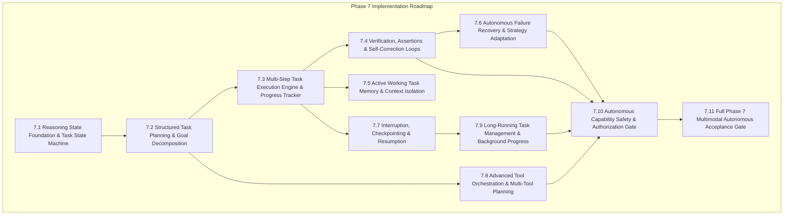

# FRIDAY — Phase 7 Implementation Plan: Advanced Autonomous Reasoning & Multi-Step Task Execution

**Document Version**: 1.0.0  
**Phase**: Phase 7 (Autonomous Reasoning, Goal Tracking & Multi-Step Task Execution)  
**Date**: 2026-08-20  
**Baseline Commit**: `604236843c308b0bb7c925b1e3aba29b580d5e42`  
**Status**: DRAFT / APPROVED FOR IMPLEMENTATION  

---

## 1. Executive Summary & Phase 7 Goal

Phase 6 successfully established multimodal vision, screen understanding, safe snapshot capturing, live voice integration, credential failover, and hard-blocked computer action proposals (`Proposal != Execution`). 

The goal of **Phase 7** is to elevate FRIDAY from a single-turn reactive agent into an **autonomous, self-correcting, multi-step problem solver** capable of decomposing complex goals into planned stages, executing actions with strict verification, maintaining active task state across interruptions, and recovering from failures—all while preserving zero-trust security, provider independence, and strict authorization boundaries.

---

## 2. Current Architecture & Gap Analysis

| Architecture Area | Current Implementation State | Identified Gaps for Phase 7 |
| :--- | :--- | :--- |
| **Reasoning State Machine** | **PARTIAL**: Basic `max_tool_iterations` while-loop inside `FridayAgent.process_message`. | No explicit state machine (`UNDERSTANDING`, `PLANNING`, `EXECUTING`, `VERIFYING`, `COMPLETED`, `FAILED`). No structured state transitions. |
| **Task Planning** | **PARTIAL**: Dynamic single-step tool calling driven entirely by prompt and model response. | No formal `TaskPlan`, step decomposition, dependency tracking, or pre-execution validation before execution. |
| **Multi-Step Execution** | **PARTIAL**: Sequential and parallel tool batch execution exists in `agent.py`. | No step-by-step progress tracking, pause/resume capability, or partial rollback on step failure. |
| **Verification & Self-Correction** | **MISSING**: Agent accepts tool output as truth and returns response directly without asserting post-conditions. | No structured verification stage (`assert_task_outcome`), deterministic criteria checks, or active replanning loops. |
| **Task Memory & Working Context** | **PARTIAL**: SQLite conversation memory stores full message history; semantic embeddings and FTS recall historical context. | No decoupled **Short-Term Working Task State** (`ActiveTaskContext`) to prevent context contamination across long sub-tasks. |
| **Failure Recovery** | **PARTIAL**: Credential pool handles 429/quota failover; tool execution catches generic exceptions. | No automated strategy adaptation (e.g. tool fallback, alternative query generation, retry budgeting). |
| **Interruption & Resumption** | **PARTIAL**: Gemini Live handles server VAD and voice interruption; background scheduler handles interval cron. | Active multi-step agent tasks cannot be paused mid-flight, checkpointed to SQLite, and resumed seamlessly. |
| **Long-Running Task Management**| **PARTIAL**: `TaskScheduler` in `tasks/scheduler.py` handles periodic cron tasks. | Disconnected from `FridayAgent` reasoning loop; lacks goal progress tracking, timeouts, and structured state reporting. |
| **Computer Control Safety** | **COMPLETE & SOLID**: `ComputerActionProposal` + `ComputerActionExecutor` enforce strict hard-blocks and mandatory confirmation. | Must ensure new autonomous planning layers never bypass `Proposal != Execution` or auto-authorize sensitive actions. |
| **Provider Independence** | **COMPLETE**: Clean `BaseLLMProvider` and `MockLLMProvider` abstractions. | Must ensure all Phase 7 planning and state machine tests remain 100% testable offline with `MockLLMProvider`. |

---

## 3. Recommended Phase 7 Subphases & Dependency Order

### Detailed Subphase Breakdown

#### Phase 7.1 — Reasoning State Foundation & Task State Machine [COMPLETE]
- Implement `TaskState` enumeration: `NOT_STARTED`, `UNDERSTANDING`, `PLANNING`, `EXECUTING`, `VERIFYING`, `COMPLETED`, `FAILED`.
- Implement `ReasoningStateMachine` with explicit valid state transitions, audit trail logging, and state change listeners.
- Integrated seamlessly into `FridayAgent` (`current_state`, `state_machine`, `get_status()`, and lifecycle logging in `process_message`).
- **Files Created/Modified**: `src/friday/agent/state.py`, `src/friday/agent/agent.py`, `src/friday/agent/__init__.py`, `tests/test_reasoning_state.py` (10/10 tests passing).

#### Phase 7.2 — Structured Task Planning & Goal Decomposition [COMPLETE]
- Implement `TaskPlan`, `PlanStep`, `StepStatus`, `PlanValidationError`, and `GoalDecomposer`.
- Define step dependencies, expected inputs/outputs, safety requirements, and pre-execution validation.
- Prevent arbitrary shell or destructive generation in plans via strict schema & safety elevation validation.
- Integrated into `FridayAgent` (`create_plan`, `current_plan`, and active plan status tracking in `get_status()`).
- **Files Created/Modified**: `src/friday/agent/planner.py`, `src/friday/agent/agent.py`, `src/friday/agent/__init__.py`, `tests/test_task_planner.py` (10/10 tests passing).

#### Phase 7.3 — Multi-Step Task Execution Engine & Progress Tracker [COMPLETE]
- Implement `TaskExecutionEngine`, `ExecutionProgress`, `StepExecutionResult`, and `TaskExecutionResult`.
- Execute `PlanStep` items strictly in dependency order with failure cascading (failed prerequisites cause dependent steps to be marked SKIPPED).
- Track step progress, elapsed time, step results, and realtime progress callbacks.
- Enforce strict per-step safety checks and authorization boundaries with bounded execution limits.
- Integrated into `FridayAgent` (`execute_plan` method with progress tracking).
- **Files Created/Modified**: `src/friday/agent/executor.py`, `src/friday/agent/agent.py`, `src/friday/agent/__init__.py`, `tests/test_multi_step_execution.py` (8/8 tests passing).

#### Phase 7.4 — Verification, Assertions & Self-Correction Loops [COMPLETE]
- Implement post-step and task-level formal verification (`StepVerifier`, `VerificationResult`, and `VerificationStatus`).
- Support explicit assertion criteria (`contains:<substr>`, `regex:<pattern>`, and semantic output heuristics).
- Enable bounded self-correction loops (`SelfCorrectionPolicy`): diagnose failure, generate adjusted steps, retry within strict budget (max 3), and re-verify without infinite loops.
- Integrated into `TaskExecutionEngine` with preservation of `BaseAuthorizer` gating and Proposal != Execution.
- **Files Created/Modified**: `src/friday/agent/verification.py`, `src/friday/agent/executor.py`, `src/friday/agent/__init__.py`, `tests/test_verification_and_correction.py` (6/6 tests passing).

#### Phase 7.5 — Active Working Task Memory & Context Isolation [COMPLETE]
- Implement `ActiveTaskContext` and `TaskObservation` to hold short-term variables, step outputs, observations, constraints, and user clarifications during execution.
- Isolate working memory from long-term memory to prevent token bloat, raw screenshot leakage, and context contamination.
- Implement size limits, observation FIFO sliding windows, secret redaction, and clean task finalization extraction into long-term memory.
- Integrated into `FridayAgent` (`task_context`, `create_plan`, `execute_plan`, and `get_status()`).
- **Files Created/Modified**: `src/friday/memory/task_context.py`, `src/friday/memory/__init__.py`, `src/friday/agent/agent.py`, `src/friday/agent/executor.py`, `tests/test_task_memory.py` (8/8 tests passing).

#### Phase 7.6 — Autonomous Failure Recovery & Strategy Adaptation [COMPLETE]
- Implement structured failure classification (`FailureType`) and recovery strategy selection (`RecoveryStrategy`, `FailureDiagnosis`).
- Implement deterministic failure analyzer (`FailureAnalyzer`) detecting transient network timeouts, quota limits, argument errors, authorization denials, and unrecoverable safety hard-blocks.
- Implement `AutonomousRecoveryManager` enforcing per-step retry limits and global task retry budgets to prevent retry storms and infinite loops.
- Integrated into `TaskExecutionEngine` with tool fallback substitution and strict authorization gating.
- **Files Created/Modified**: `src/friday/agent/recovery.py`, `src/friday/agent/executor.py`, `src/friday/agent/__init__.py`, `tests/test_failure_recovery.py` (6/6 tests passing).

#### Phase 7.7 — Interruption, Checkpointing & Resumption [COMPLETE]
- Extend `TaskState` with `PAUSED` and `CANCELLED` lifecycle states, supporting pause, resume, and cancel transitions.
- Implement `TaskCheckpoint` and `TaskCheckpointStore` with memory and SQLite persistence backends.
- Enforce strict checkpoint sanitization: excludes secrets, credentials, raw screenshots, and binary payload buffers.
- Integrated into `FridayAgent` (`pause_current_task`, `resume_task`, `cancel_task`) and `TaskExecutionEngine` with pre-completed step skipping to prevent duplicate action execution.
- **Files Created/Modified**: `src/friday/agent/state.py`, `src/friday/agent/checkpoint.py`, `src/friday/agent/planner.py`, `src/friday/agent/agent.py`, `src/friday/agent/executor.py`, `src/friday/agent/__init__.py`, `tests/test_task_checkpointing.py` (6/6 tests passing).

#### Phase 7.8 — Advanced Tool Orchestration & Multi-Tool Planning [COMPLETE]
- Implement `DataFlowResolver` resolving dynamic parameter templates (`{{step_id.key}}` and `{{step_id}}`) across chained tool steps.
- Implement untrusted screen text / injection defense: blocks dangerous commands or malicious text in perceptual inputs from interpolating into sensitive/dangerous tool arguments.
- Implement `ToolOrchestrator` computing DAG execution levels (waves) for independent parallel grouping vs. sequential chaining.
- Integrated into `TaskExecutionEngine` with dynamic argument validation and BaseAuthorizer enforcement.
- **Files Created/Modified**: `src/friday/tools/orchestrator.py`, `src/friday/tools/__init__.py`, `src/friday/agent/executor.py`, `tests/test_advanced_tool_planning.py` (5/5 tests passing).

#### Phase 7.9 — Long-Running Task Management & Background Progress [COMPLETE]
- Implement `LongRunningTaskManager`, `TaskLifecycleStatus`, and `TaskProgressReport`.
- Support background task submission, concurrent worker limits, duplicate active task prevention, progress telemetry reporting, and thread-safe querying.
- Enforce hard execution timeouts, pause/resume checkpoint integration, and safe immediate cancellation.
- Preserve zero-trust security: Never bypasses `BaseAuthorizer` or auto-approves dangerous operations.
- **Files Created/Modified**: `src/friday/tasks/manager.py`, `src/friday/tasks/__init__.py`, `src/friday/tasks/scheduler.py`, `tests/test_long_running_tasks.py` (5/5 tests passing).

#### Phase 7.10 — Autonomous Capability Safety & Authorization Gate [COMPLETE]
- Conducted comprehensive 10-vector security audit covering prompt injection in OCR/screen text, Proposal != Execution boundaries, hard-blocked operations (format, rm -rf, drop table, kill process, shell execution), user confirmation bypass defense, self-correction/recovery bypass defense, background execution security, checkpoint sanitization, working context secret isolation, dynamic parameter injection defense, and offline provider independence.
- Verified that all autonomous multi-step execution flows strictly respect `BaseAuthorizer` and `DefaultSecureAuthorizer` without privilege escalation or safety bypass.
- **Files Created/Modified**: `src/friday/tools/orchestrator.py`, `src/friday/memory/task_context.py`, `tests/test_security_audit_phase7.py` (10/10 tests passing).

#### Phase 7.11 — Full Phase 7 Multimodal Autonomous Acceptance Gate [COMPLETE]
- Implemented comprehensive 8-scenario acceptance gate suite (`tests/test_phase7_acceptance_gate.py`).
- Validated complete end-to-end integration: Complex Goal Decomposition → BaseAuthorizer Gated Multi-Step Execution → Multimodal Perception + Action Proposal Sandbox Flow → Verification & Bounded Self-Correction → Voice Barge-In / Interruption & Resumption → Dynamic Parameter Chaining (Data Flow) → Untrusted Screen / Prompt Injection Defense → Background Task Management & Timeout Bounds → Secret Redaction & Privacy Persistence.
- Verified 100% provider independence with zero vendor cloud SDK coupling in core reasoning engines.
- **Files Created/Modified**: `tests/test_phase7_acceptance_gate.py` (8/8 tests passing).

---

## 4. Security & Safety Strategy

1. **Proposal != Execution**: Even when FRIDAY autonomously generates multi-step plans involving computer actions, individual action steps remain proposals until explicitly confirmed by the user.
2. **Hard-Blocked Intentions**: Password entry, API key handling, financial transactions, partition formatting, and raw shell execution remain strictly prohibited in both single-turn and multi-step plans.
3. **Budgeted Iterations & Retries**: Every plan enforces strict timeouts (default 120s), max step iterations (default 10), and max self-correction retries (default 3) to prevent runaway execution or credit consumption.
4. **Untrusted Data Boundary**: Visual observations and external web/file contents remain tagged as `UNTRUSTED DATA` throughout all planning and reasoning stages.

---

## 5. Performance, Quota & Provider Independence Strategy

1. **Local-First Reasoning**: Step validation, state transitions, syntax checks, and hash deduplication run purely locally in Python without consuming cloud API tokens.
2. **Context Compression**: Intermediate step logs remain in `ActiveTaskContext` and are summarized before injection into LLM prompts.
3. **Provider Abstraction**: All Phase 7 components interact exclusively with `BaseLLMProvider` and `BaseVisionProvider`. 100% of unit and integration tests run offline with `MockLLMProvider`.
4. **IBM Quantum Status**: Reserved for a future specialized compute phase (Phase 8+). Zero quantum dependencies or placeholder code will be introduced in Phase 7.

---

## 6. Stop Conditions & Execution Protocol

- **Phase 7 Implementation has NOT started**.
- Each subphase (7.1 through 7.11) will be executed sequentially: `inspect → implement → test → verify → document → continue`.
- Every subphase will be accompanied by deterministic unit tests and updated daily diary entries.
